# Dental Care App

**Language:** English | [Українська](README.ua.md)

Dental Care App is a mobile application built with **React Native CLI**, created as an MVP solution for a dental clinic. The main goal of the application is to increase patient conversion into real appointments, simplify communication between the patient and the clinic, and make the treatment process more convenient and controlled.

The application helps users manage their dental care: browse doctors, choose dental services, book appointments, view visit history, and control their medication plan after treatment. This improves the user experience and helps patients follow the doctor’s recommendations more consistently after a procedure.

In the future, the project is planned to be expanded with a CRM web version for the dental clinic. It will allow administrators and doctors to manage appointments, view clinic performance statistics, monitor doctors’ workload, and analyze the effectiveness of patient interaction.

---

## 1. Analysis of the Existing Application

The application already has a complete structure with authentication, navigation, a home screen, appointment booking, a user profile, and visit history.

### Key Features

- **Onboarding** — introductory screens that introduce the user to the application.
- **Authentication and Registration** — login, registration, and OTP confirmation.
- **Home Screen** — visit statistics, upcoming appointment, quick actions, banners, and a trust block.
- **Doctor Appointment Booking** — selection of service, doctor, date, time, and booking confirmation.
- **Doctor Profile** — information about the doctor, rating, education, reviews, and a booking button.
- **Visit History** — viewing past and upcoming appointments.
- **User Profile** — personal information and main account actions.

### Main User Scenarios

1. The user opens the application, completes onboarding, and signs in.
2. On the home screen, the user sees short statistics, an upcoming appointment, and quick actions.
3. The user goes to the booking flow, selects a dental service, doctor, date, and time.
4. After confirmation, the appointment is saved and displayed in the visit history.
5. If a treatment plan has been created for the user, they can see medication reminders and mark medicines as taken.

### Areas for Functional Expansion

1. **Navigation Improvement**  
   Quick actions on the home screen should lead the user to the required sections: booking, chat, and visit history.

2. **Adding the Medications Section**  
   The user can view the treatment plan, medication list, dosage, intake time, and daily progress.

3. **UX/UI Improvement**  
   The application uses a consistent design system: colors, spacing, cards, icons, buttons, border radius, and shadows.

---

## 2. Functionality Expansion

### Added Functionality: Medications

The **Medications** section was added to display the user’s active treatment plan after a dental procedure.

The functionality includes:

- treatment period;
- current treatment day;
- treatment progress;
- list of medicines for today;
- dosage and intake time;
- ability to mark a medicine as taken;
- full treatment plan overview.

This feature improves the user experience because the user not only books an appointment with a doctor but can also control the treatment process after the visit.

### Quick Actions Navigation Improvement

On the home screen, the quick actions block was extended with callback functions:

- **Book Appointment** → navigates to appointment booking;
- **Find Doctor** → navigates to the booking/doctor search section;
- **Chat Support** → navigates to the chat;
- **View Records** → navigates to visit history.

This makes the home screen more practical because the user can quickly move to the main application scenarios.

---

## 3. State Management

The application uses several state management approaches depending on the type of data.

### Context API

**Context API** is used for global state that is required in different parts of the application:

- `AuthContext` — authentication state, user profile, login/logout, OTP registration;
- `ThemeContext` — current theme and the ability to switch it.

Context API was chosen because this data has a global nature and does not require a complex Redux architecture.

### React Query

**TanStack React Query** is used for server data:

- doctors;
- appointments;
- slots;
- visit history;
- treatment plans;
- medication intake.

React Query is more suitable for this than Redux because it automatically handles caching, loading states, errors, and server data updates.

---

## 4. Component-Based Approach

The project is built using a component-based approach. Each major UI element is placed in a separate file or folder.

### Component Examples

- `AppointmentCard` — card for the upcoming appointment;
- `EmptyAppointmentCard` — state when there are no appointments;
- `MedicationReminder` — short medication reminder on the home screen;
- `MedicationItem` — medication list item;
- `DoctorCard` — doctor card;
- `ServiceCard` — dental service card;
- `QuickActionCard` — quick action on the home screen;
- `CustomBtn` — custom button with different states;
- `TrustBlock` — trust and security block.

This structure makes the code more understandable, modular, and easier to maintain.

---

## 5. UX/UI Improvements

The user experience in the application was improved through:

- clear bottom navigation;
- smooth header animation on the home screen;
- visually separated cards;
- consistent color palette;
- clear loading/empty/content states;
- passing parameters between screens, for example:
  - `DoctorList` → `DoctorProfile`;
  - `DoctorProfile` → `SelectDate`;
  - `SelectDate` → `BookingConfirm`;
  - `VisitHistory` → `VisitDetails`.

---

## 6. Project Structure

```txt
src/
  api/                 # Firebase API and data requests
  assets/              # icons, images, screenshots
  components/          # large reusable components
  constants/           # routes, theme, collections, static data
  context/             # AuthContext, ThemeContext
  hook/                # custom hooks
  interfaces/          # TypeScript types
  layout/              # shared layout components
  mockData/            # local test data
  navigation/          # Root, Tab, and Stack navigation
  screens/             # application screens
  ui/                  # small UI components
  utils/               # helper functions

---

### Onboarding and Authentication

| Onboarding 1                                                   | Onboarding 2                                                   | Login                                             |
| -------------------------------------------------------------- | -------------------------------------------------------------- | ------------------------------------------------- |
| 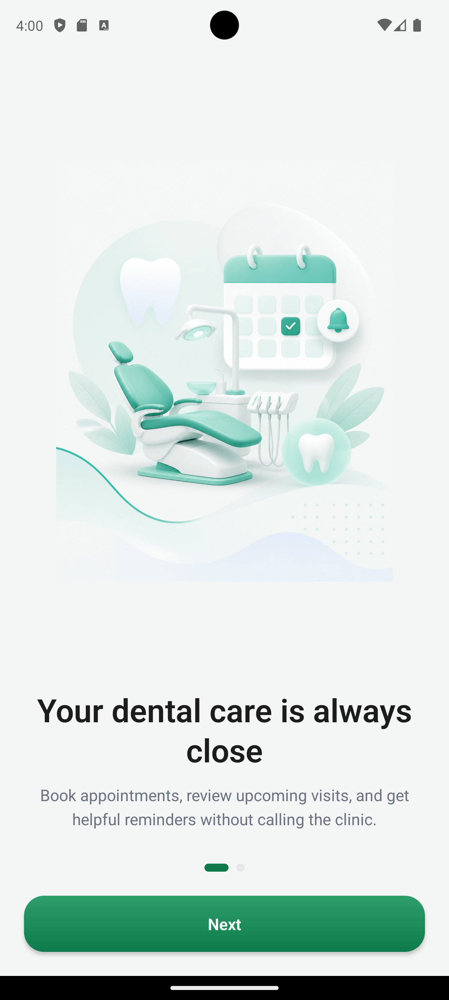 | 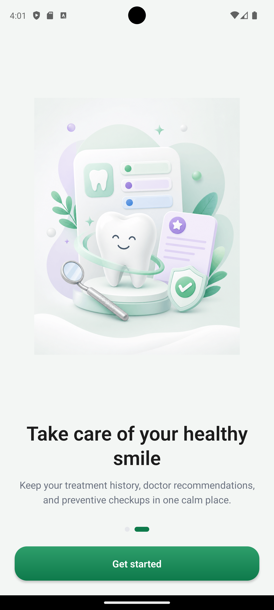 | 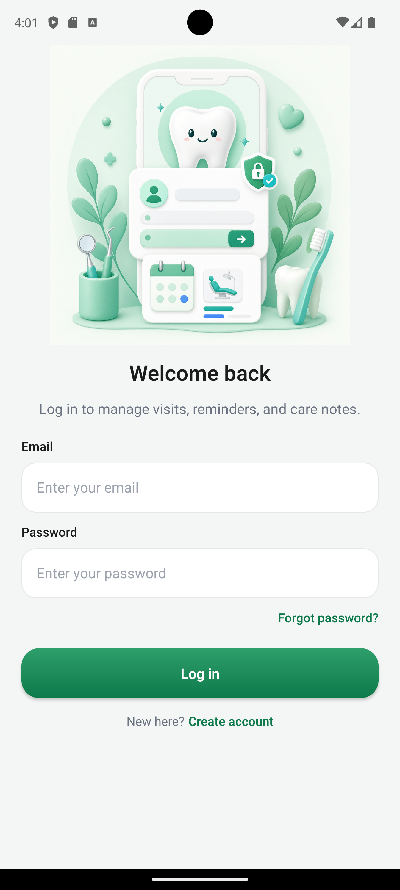 |

| Register                                                | OTP                                          |
| ------------------------------------------------------- | -------------------------------------------- |
| 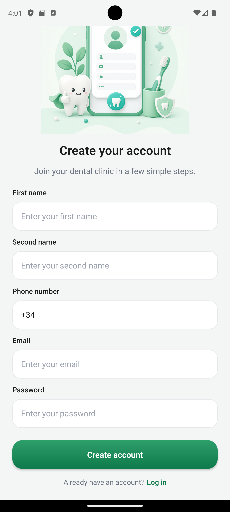 | 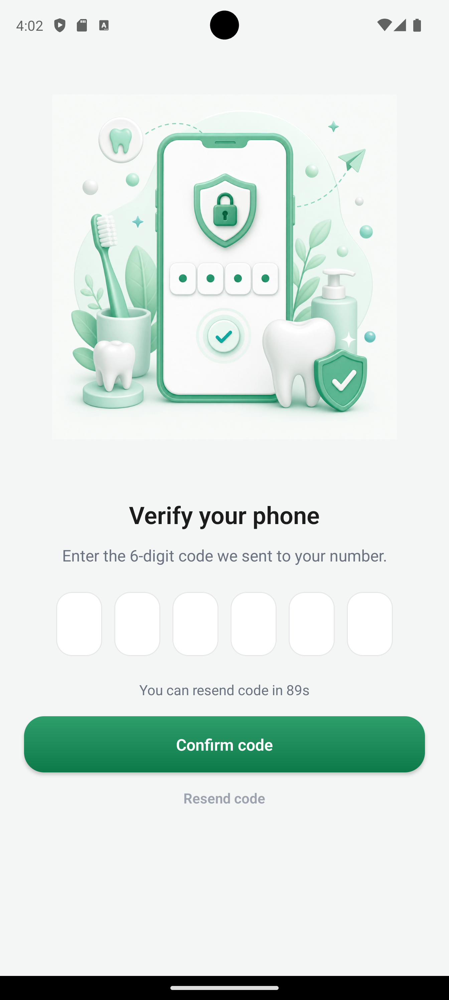 |

### Main Screens
| Home                                                 | Home Empty                                                  | Profile                                               |
| ---------------------------------------------------- | ----------------------------------------------------------- | ----------------------------------------------------- |
| 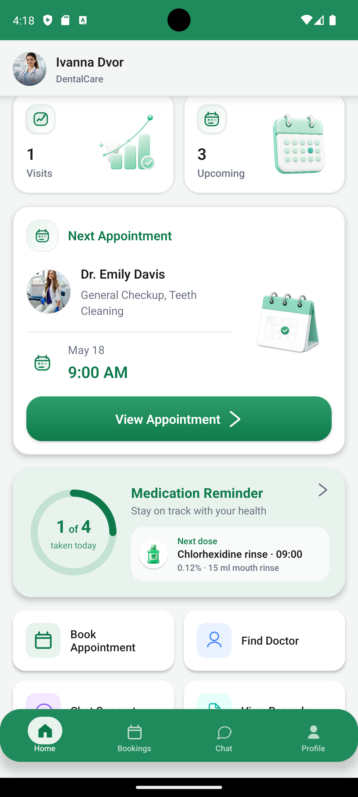 | 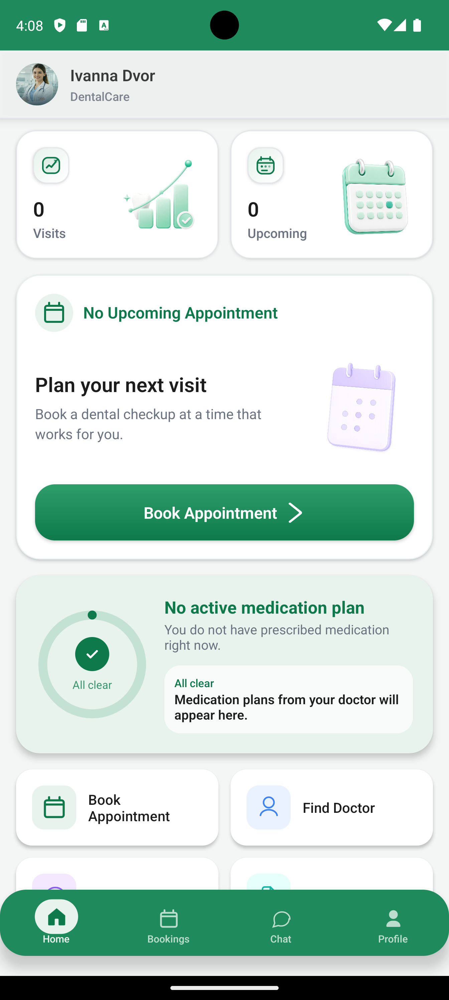 | 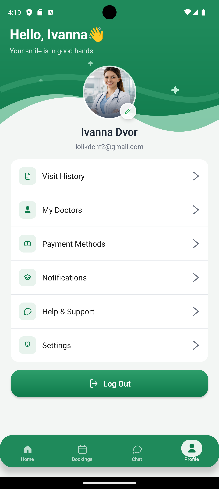 |

### Doctor Appointment Booking

| Services                                               | Doctors                                                   | Doctor Profile                                                     |
| ------------------------------------------------------ | --------------------------------------------------------- | ------------------------------------------------------------------ |
| 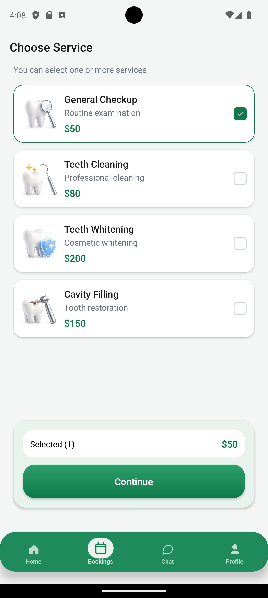 | 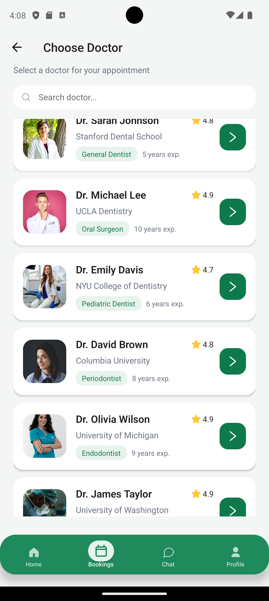 | 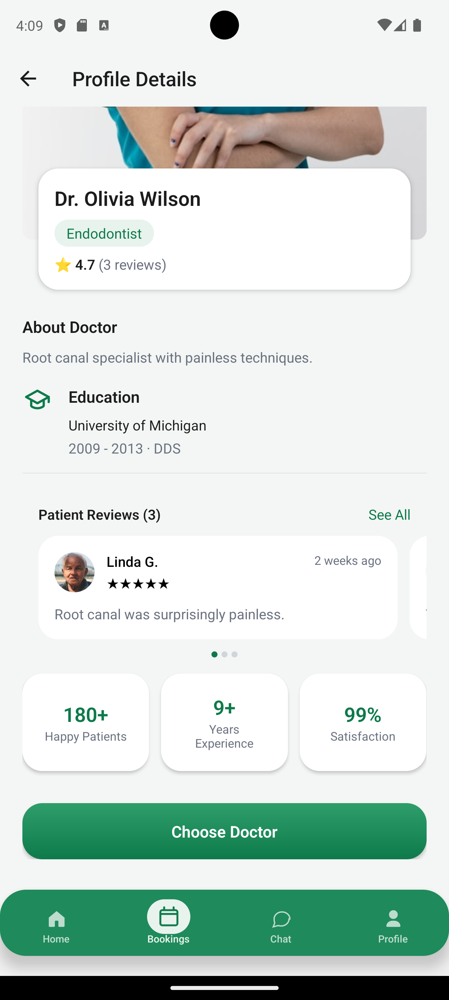 |

| Select Date                                                   | Confirm Booking                                                      |
| ------------------------------------------------------------- | -------------------------------------------------------------------- |
| 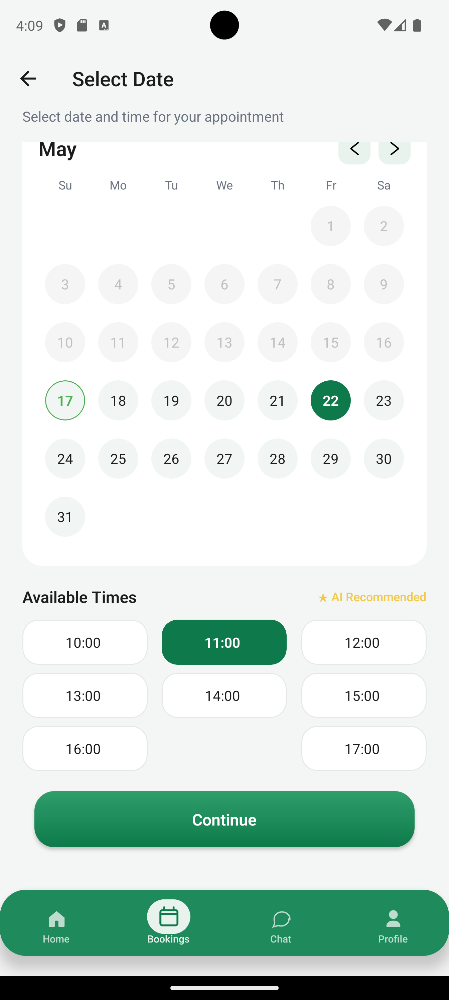 | 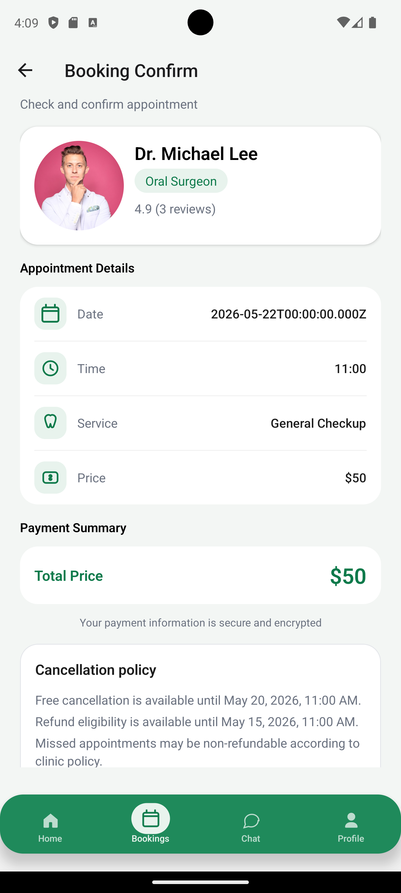 |

### History and Treatment

| Visit History                                                     | Visit Details                                                    | Medications                                                  |
| ----------------------------------------------------------------- | ---------------------------------------------------------------- | ------------------------------------------------------------ |
| 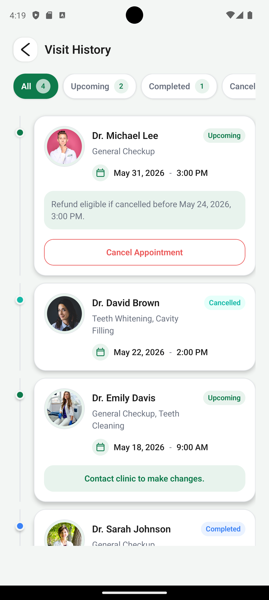 | 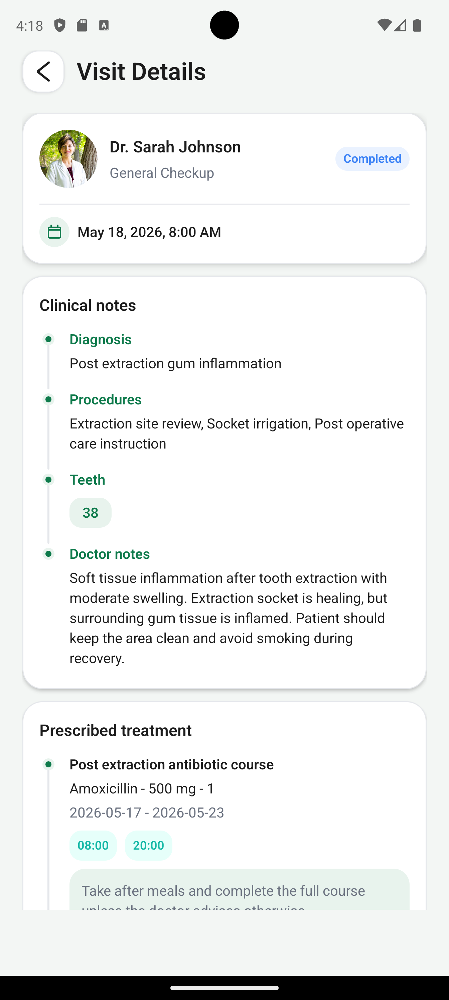 | 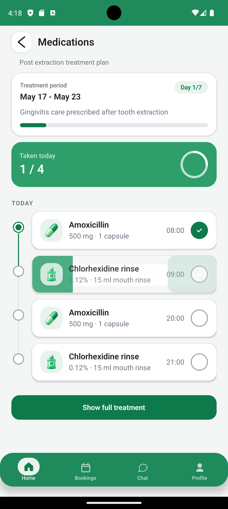 |

---

8. Presentation Overview
Slide 1. Main Idea

Dental Care App is an application for organizing dental care: from choosing a doctor to controlling treatment after a visit.

Slide 2. Key Features
user authentication;
appointment booking with a dentist;
viewing doctors;
selecting date and time;
visit history;
user profile;
medication reminders.
Slide 3. New Functionality

The main extension is the Medications section, which allows the user to control the treatment plan, view progress, and mark medicines as taken.

Slide 4. Structure and Usability

The application has a modular structure: separate screens, components, hooks, API layer, contexts, and utilities. This makes the project easier to maintain, extend, and reuse.

9. Future Functionality

In the future, the application can be expanded with additional features that will make the service more useful for both patients and the dental clinic.

It is planned to add push notifications that will remind the user about medication intake time and upcoming doctor appointments without the need to open the application.

AI-based recommendations can also be implemented in the date and time selection section. For example, when choosing an appointment time, the system will be able to highlight recommended time slots based on the doctor’s workload, the average duration of the selected procedure, and previous data provided by the patient during registration or treatment selection.

Another development direction is the creation of a CRM web version for the clinic. It will allow clinic staff to manage patients, appointments, doctors, schedules, and clinic performance statistics.

10. Conclusion

As a result, the application was expanded with new functionality for medication intake control, quick actions navigation was improved, and the architecture, state management, components, and UX/UI decisions were described. The project became more complete and better aligned with a real-life use case of a dental application.
```
